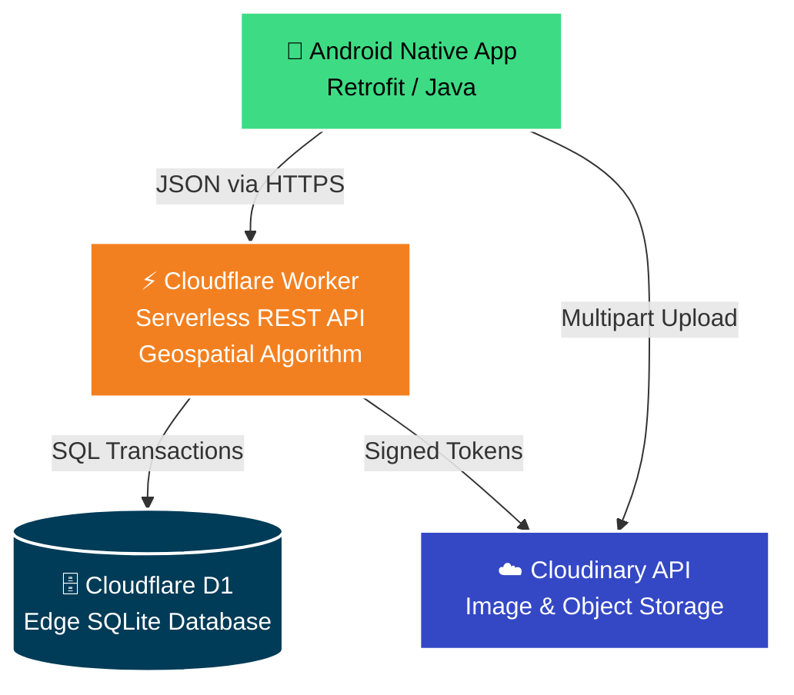
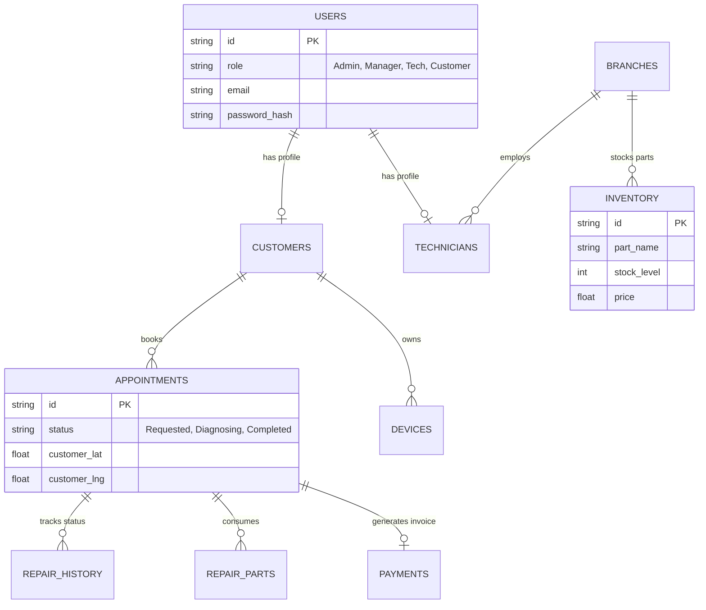

<div align="center">


# 📱 TechFix - Enterprise Edge-Powered Repair Management System

**A massively scalable, multi-role Android application powered by Cloudflare's serverless edge computing and D1 SQLite.**

[](#)
[](#)
[](#)
[](#)
[](#)
[](https://opensource.org/licenses/MIT)

*Bridging the gap between technicians, shop managers, and customers with sub-millisecond edge latency.*

</div>

---

<p align="center">
  <a href="https://streamable.com/x1kgdd">
    
  </a>
</p>

## 🎯 Project Overview

**TechFix** is a comprehensive, enterprise-grade mobile platform designed to orchestrate the entire lifecycle of device repairs. Built natively for Android, the application eliminates operational bottlenecks using an ultra-fast, serverless backend via **Cloudflare Workers** and **D1 (SQLite at the Edge)**. 

From **real-time geospatial routing** of customer requests to **multi-tier Role-Based Access Control (RBAC)**, inventory management, and robust financial reporting, TechFix brings modern edge-computing architecture to technical repair chains.

---

## 🌟 Advanced System Highlights

- 📍 **Algorithmic Geospatial Auto-Routing:** Integrates the **Haversine formula** on the backend to dynamically calculate the distance from a customer's GPS coordinates to all active branches. Automatically assigns repairs to the nearest branch with available technicians and required spare parts.
- ⚡ **Global Edge-Native Speed:** APIs are executed globally within milliseconds of the end user via Cloudflare Workers. Database queries are distributed and optimized using Cloudflare D1.
- 🛡️ **Zero-Trust Security & RBAC:** Features auto-generated secure credentials for new staff, forced mandatory password resets upon first login, and strict RBAC enforced via stateless **JWTs** verified at the edge.
- 📸 **Cloud-Native Media Storage:** Seamless integration with Cloudinary for uploading and tracking device condition images, pre-repair, and post-repair photographic evidence.
- 📡 **Offline-Ready Mobile Architecture:** Built with modern Android standards utilizing Room Database for intelligent local caching, ensuring technicians can view their tasks even with spotty connectivity.

---

## 🏗️ System Architecture

TechFix embraces an **Edge-First Architecture**. By distributing backend logic directly on Cloudflare's CDN edge nodes, the app guarantees high availability and minimal latency for data-heavy operations.



---

## 👥 Comprehensive Role Modules (The Team)

TechFix is a collaborative masterpiece built around four distinct domains, each meticulously crafted to handle a specific facet of the repair business lifecycle.

### 🧠 Member 1: Core Backend, API & Edge Security
**Domain:** Cloudflare Workers API, D1 Database, JWT Authentication, and Global Business Logic.
* Orchestrates the serverless **REST API** using Node.js on Cloudflare Workers.
* Designs and maintains the **Cloudflare D1** SQLite relational database schema ensuring ACID compliance.
* Implements the **PBKDF2 SHA-256** password hashing and stateless **JWT validation**.
* Enforces strict **Role-Based Authorization**, API validation, and error handling.
* Powers the complex business rules for appointment lifecycles and technician assignment tracking.

### 📱 Member 2: Customer Repair Journey
**Domain:** Customer UI, Appointments, and Repair Tracking.
* Provides the frontend experience for end-users to register, login, and manage their devices.
* Drives the **Book a Repair** flow allowing customers to select services, dates, times, and map coordinates.
* Builds the live **Repair Tracking timeline** (`REQUESTED` → `ASSIGNED` → `DIAGNOSING` → `REPAIRING` → `TESTING` → `COMPLETED`).
* Manages the complete **Repair History** viewing functionality for transparency.

### 🏢 Member 3: Branch & Technician Administration
**Domain:** Control Center, Admin Dashboard, Staff Allocation.
* Creates the **Management Dashboard** to view overall business health and system metrics.
* Manages **Branch Operations**, including geospatial coordinates and branch status.
* Administers the **Technician Roster**, assigning skills, specialization, and managing availability states (`AVAILABLE`, `BUSY`, `OFF_DUTY`, `ON_LEAVE`).
* Handles the manual override **Technician Assignment UI**, pairing pending repairs with the correct staff.

### 💰 Member 4: Inventory, Finances & Reports
**Domain:** Spare Parts management, Payments processing, Analytics.
* Constructs the **Spare Parts Ledger**, tracking stock quantity, prices, and low-stock alerts.
* Integrates **Payment Processing** screens, tracking payment intents (`PAID`, `FAILED`, `REFUNDED`), capturing receipts, and total costs based on parts consumed.
* Builds dynamic **Management Reports** visualizing Revenue, Active Repairs, Parts utilization, and Branch performance metrics.

---

## 🗄️ Database Schema Snapshot

The D1 database is highly normalized to ensure data integrity during parallel API transactions and automated routing algorithms.



---

## 🔐 Advanced Security Implementations

- **PBKDF2 Edge Hashing:** Passwords are never stored in plaintext. They are salted and hashed natively inside the V8 engine on the Cloudflare Edge using high-iteration PBKDF2 (SHA-256).
- **Stateless JWT Authorization:** API tokens are generated and signed with Web Crypto API HMAC. The Worker middleware validates claims natively without requiring a database lookup for every request.
- **Strict Role Boundaries:** All endpoints utilize granular interceptors to match the exact role claim `(Admin, Manager, Technician, Customer)` required before routing transactions.
- **SQL Injection Prevention:** 100% parameterized queries via D1 SQLite Bindings natively prevent payload injection. Case-insensitive routing enforces email collision checks via `LOWER()` SQL.

---

## 🚀 Complete Deployment Guide

Follow these steps to deploy both the highly-available backend and the native Android frontend.

### 1️⃣ Serverless Edge Backend (Cloudflare Workers + D1)

**Prerequisites:** 
- Install [Node.js](https://nodejs.org/) and NPM.
- Install Wrangler CLI globally: `npm install -g wrangler`

<details>
<summary><b>Click to expand backend deployment steps</b></summary>
<br>

1. **Login to Cloudflare**
   ```bash
   npx wrangler login
   ```
2. **Navigate to the Backend Directory**
   ```bash
   cd cloudflare-backend
   ```
3. **Initialize the Database**
   Create a new D1 database via your Cloudflare Dashboard, or using the CLI:
   ```bash
   npx wrangler d1 create techfix-db
   ```
   *Copy the generated `database_id` and paste it into `cloudflare-backend/wrangler.toml`.*
4. **Set Environment Variables**
   Ensure `JWT_SECRET` is populated in your `wrangler.toml` file under the `[vars]` block for token generation to work successfully.
5. **Run the Schema Migrations**
   Push the table structures to your remote D1 instance:
   ```bash
   npx wrangler d1 execute techfix-db --remote --file=./schema.sql
   ```
6. **Deploy the Worker globally**
   ```bash
   npx wrangler deploy
   ```
   *This will output a live CDN URL (e.g., `https://techfix-backend.<your-subdomain>.workers.dev`)*.

</details>

### 2️⃣ Mobile Frontend (Android Studio)

**Prerequisites:**
- Install [Android Studio](https://developer.android.com/studio) (Giraffe or later).
- Java Development Kit (JDK 17).

<details>
<summary><b>Click to expand Android setup steps</b></summary>
<br>

1. **Open the Project**
   Open the root `TECHFIX` folder inside Android Studio.
2. **Connect the Edge Backend**
   Open the following file:
   `app/src/main/java/com/mad/techfix/network/RetrofitClient.java`
   
   Replace the `BASE_URL` with your fully unified Cloudflare Worker deployment URL:
   ```java
   private static final String BASE_URL = "https://techfix-backend.<your-subdomain>.workers.dev/";
   ```
3. **Sync and Build**
   - Wait for Gradle to sync dependencies.
   - Click **Run (Shift + F10)** to launch the app on an emulator or physical device.

</details>

---

## 📸 Application Gallery

*(Add your application screenshots here in an organized grid)*

| Customer Dashboard | Repair Tracking | Admin Analytics | Parts Ledger |
|:---:|:---:|:---:|:---:|
|  |  |  |  |

---

<div align="center">
  <p><i>Developed dynamically for the Mobile Application Development Module.</i></p>
  <b>Licensed under the MIT License</b><br>
  ⭐⭐⭐ If you find this project useful, don't forget to star the repository! ⭐⭐⭐
</div>
